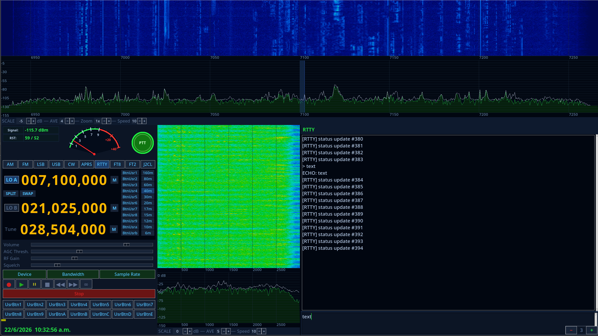

# Interfaz CAT GUI

<div align="center">
  <a href="https://github.com/hiperiondev/RadioCAT_GUI">
    
  </a>
</div>

Este proyecto es una **Interfaz CAT GUI** en Python/Tkinter — un front-end SDR
cuyos controles se comunican con un pequeño backend de radio a través de un
socket TCP simple.

Consta de dos archivos:

- `cat_server.py` — un servidor TCP que actúa como capa de hardware/backend.
  Gestiona todo el "estado de radio", transmite un entorno RF simulado y administra
  un canal de audio RTP/UDP bidireccional.
- `cat_gui.py` — un cliente Tkinter que provee la ventana principal de la Interfaz CAT GUI
  y envía cada interacción del usuario al servidor, redibujando a partir de los
  datos que el servidor transmite de vuelta. También reproduce el audio RTP recibido
  y envía audio del micrófono durante PTT.

---

## 1. Descripción general de la interfaz

La Interfaz CAT GUI es una aplicación Python/Tkinter para el control de Radio Definida por Software.
Puntos clave:

- **Sin acceso directo al hardware.** La GUI se comunica con su backend a través de
  `cat_server.py`, que abstrae cualquier dispositivo SDR específico y expone
  una API TCP común para configurar frecuencia, tasa de muestreo, ganancia e
  iniciar/detener el flujo I/Q.
- **Distribución de la ventana principal** centrada en:
  - Pantallas de frecuencia estilo LCD ámbar de 9 dígitos para **LO A**, **LO B**
    y **Tune**, cada una sintonizable desplazando o haciendo clic en dígitos individuales o
    haciendo doble clic para escribir una frecuencia. LO A y LO B son seleccionables;
    el LO activo maneja la frecuencia central de la cascada/espectro RF.
  - Una pantalla de espectro RF (FFT) y una cascada RF encima, centradas en
    la frecuencia del LO activo y abarcando la tasa de muestreo del receptor
    (más estrecha si está "ampliada").
  - Una superposición de pasabanda IF/filtro arrastrable dibujada directamente sobre el espectro,
    cuyos bordes establecen el ancho de banda del demodulador.
  - Sin filas fijas de botones de Modo o alternancia DSP — la selección de modo y los
    alternadores DSP se implementan completamente a través de los bancos de botones
    definidos por el usuario, con etiquetas del servidor, ubicados debajo; la GUI no guarda
    valores predeterminados por modo (p. ej., pasabanda del filtro).
  - Hasta 14 **botones definidos por el usuario** (7 por fila, ocupando el ancho completo del panel
    en dos filas con columnas de cuadrícula de peso igual — no alineadas a la derecha),
    cuyas etiquetas y tipos (momentáneo o push-push/alternante)
    se configuran en el lado del servidor.
  - Hasta 11 **botones RF de usuario**, mostrados a la izquierda de la columna de selección de banda,
    con el mismo comportamiento momentáneo/push-push que los botones definidos por el usuario
    anteriores; configurados en el lado del servidor.
  - Un S-Meter que muestra la intensidad de señal en unidades S (S1–S9, S9 +20dB,
    S9 +40dB) y una lectura digital en dBm, derivada de la potencia dentro de la
    pasabanda del filtro actual.
  - Controles deslizantes de **Volumen** y **Umbral AGC** en el panel de control.
  - Control de zoom (rueda del ratón en el espectro, o etiquetas de la barra de herramientas) para el
    espectro RF y la cascada.
  - Un panel secundario de espectro AF (audio) + cascada que muestra la pasabanda de audio demodulado.
  - Una columna de **selección rápida de banda** (160m, 80m, 60m, 40m, 30m, 20m, 17m,
    15m, 12m, 10m, 6m) que sintoniza el LO activo actual.
  - Botones de la **barra de transporte**: Grabar (●), Reproducir (▶), Pausar (⏸), Detener (■),
    Rebobinar (◀◀), Avance rápido (▶▶) y Bucle (∞).
  - Control **Inicio/Parada** sobre el flujo del receptor.
  - Botones auxiliares del S-meter: **Pico**, **Unidades S**, **Squelch**.
  - Botones de función: **Dispositivo**, **Tarjeta de sonido**, **Ancho de banda**,
    **Tasa de muestreo**. Nota: **Tarjeta de sonido** abre un diálogo local de selección de
    dispositivo de audio y **no** envía un comando al servidor.
  - **Selector de dispositivo.** El servidor puede contener múltiples perfiles de dispositivo
    (cada uno con sus propios botones de usuario, botones RF de usuario, botones de módulo de usuario,
    lista de tasas de muestreo y definiciones de puertos de antena). `get_devices`/`select_device` permiten a la GUI listar
    y cambiar entre ellos; al cambiar se recargan los botones del dispositivo,
    las tasas de muestreo, los puertos de antena y se restaura el último estado GUI guardado.
  - **Selector de tasa de muestreo.** `get_sample_rates`/`set_sample_rate` permiten a la
    GUI consultar y cambiar la tasa de muestreo SDR del dispositivo activo desde su
    lista configurada de opciones.
  - **Memorias de frecuencia.** Cada uno de LO A, LO B y Tune tiene 20 ranuras de
    memoria almacenables (etiqueta + frecuencia), guardadas por dispositivo a través de
    `get_memories`/`save_memory`.
  - **Nivel de referencia / promediado del espectro.** `set_spec_ref` y
    `set_spec_ave` controlan de forma independiente el nivel de referencia (parte superior de la escala)
    y el conteo de promediado FFT de las pantallas de espectro RF y AF.
  - El modo **Split**, alternado a través de `set_split`, se registra en el estado de radio.
  - Un **reloj de fecha/hora** en tiempo real y un botón TCP **Conectar/Desconectar** con
    un indicador de estado de punto de color.
  - Dos barras de herramientas (una entre la cascada RF y el panel de control,
    otra en el panel AF), cada una con botones de alternancia **Cascada** / **Espectro**,
    indicador de RBW, y etiquetas de Avg, Zoom y Velocidad.
  - Una superposición persistente **HiDPI +/−** en la esquina inferior derecha para
    escalado en tiempo real desde el nivel −5 hasta +5 (factor 1.25 por paso).
  - Un botón circular PTT en el canvas (en la fila del S-meter) que alterna el
    modo de transmisión; mientras PTT está activo la GUI envía audio del micrófono al
    servidor vía RTP/UDP y deja de reproducir el audio recibido.
- **Canal de audio RTP/UDP.** Además de la conexión de control TCP, el
  servidor abre un puerto UDP (predeterminado 5004) para audio G.711 µ-law
  (PCMU) bidireccional. Mientras PTT está desactivado, el servidor transmite un tono de demostración
  sinusoidal a la GUI para reproducción; mientras PTT está activo, la GUI captura audio del micrófono y
  lo transmite al servidor. La reproducción y captura de audio usan PyAudio (opcional;
  la GUI funciona sin él, pero el audio se deshabilita silenciosamente).
- **Archivos de configuración TOML.** `cat_gui.py` crea automáticamente un único
  `cat_gui.toml` en el directorio actual al primer inicio y lo usa como
  fuente persistente de valores predeterminados. El archivo auto-generado incluye una sección `[audio]`
  con las claves `mic`, `speaker` y `disable_soundcard_select` — la última
  oculta el botón Tarjeta de sonido y equivale al flag CLI
  `--disable-soundcard-select`. `cat_server.py` usa **dos** archivos TOML:
  `cat_server.toml` (configuración de transporte más la lista `[devices]` de
  perfiles de dispositivo seleccionables) y un archivo estilo `cat_device.toml` por
  perfil de dispositivo (los botones de usuario, botones RF de usuario, botones de módulo de usuario,
  tasas de muestreo SDR y definiciones de puertos de antena de ese dispositivo). Tanto
  `cat_server.toml` como el `cat_device.toml` del dispositivo predeterminado se
  crean automáticamente al primer inicio si están ausentes. Cada dispositivo también obtiene su propio
  archivo de memoria y archivo de estado GUI creados automáticamente. Los flags CLI siempre anulan
  los valores del archivo de configuración.
- **Protocolo de control TCP personalizado.** La Interfaz CAT GUI define su propio
  protocolo JSON simple delimitado por saltos de línea entre `cat_gui.py` y
  `cat_server.py` (descrito a continuación).

## 2. Mapa de funciones

| Función CAT GUI | Implementación |
| --- | --- |
| Backend | `cat_server.py` — gestiona todo el estado de radio, genera un espectro RF simulado |
| Pantallas de dígitos VFO (LO A, LO B, Tune) | `FreqDisp` — desplazar/hacer clic en cada dígito, doble clic para escribir una frecuencia; hacer clic en la etiqueta de LO A o LO B cambia el LO activo y recentra inmediatamente la cascada |
| Espectro RF + superposición de filtro | `SpecCanvas` — bordes de pasabanda arrastrables, clic para sintonizar, desplazamiento para zoom |
| Cascada RF | `WFCanvas` (resolución de renderizado interno de 900 bins; el servidor transmite 600 puntos — la GUI interpola linealmente los 600 puntos del servidor para llenar los 900 bins de renderizado) |
| Espectro AF + cascada | par secundario `SpecCanvas` / `WFCanvas`, banda base 0..3000 Hz; calculado localmente por `RTPAudioClient._af_worker` a partir del audio RTP decodificado (FFT de 512 puntos, ventana Hamming 50% de solapamiento) — no transmitido desde el servidor |
| Selección de modo | Sin fila de botones de modo fija; se realiza mediante los botones de modulación definidos por el usuario (ver más abajo). La GUI no guarda pasabanda predeterminada por modo |
| Alternadores DSP (NR / NB RF / NB IF / AFC / Mute / AGC Med / Notch / ANotch) | Sin fila de alternadores DSP fija — eliminada de la GUI. Estas funciones, si se exponen, se implementan mediante los botones genéricos definidos por el usuario. No hay botón NB independiente; el flag de estado `nb` del servidor no tiene control GUI |
| Botones definidos por el usuario (×14) | 7 por fila, ocupando el ancho completo del panel en dos filas con columnas de cuadrícula de peso igual; etiquetas y tipos provienen del servidor |
| Botones RF de usuario (×11) | Mostrados a la izquierda de la columna de selección de banda; etiquetas y tipos provienen del servidor; momentáneo o push-push, igual que los botones definidos por el usuario |
| Botones de modulación definidos por el usuario (×10) | Configurables mediante `--user_mod_1`…`--user_mod_10` / `--user_mod_type_1`…`--user_mod_type_10` (etiquetas máximo 4 caracteres); etiquetas y tipos en los campos de estado `user_mod_labels` / `user_mod_types` |
| Reproducción de wav IQ / wav de audio | `IQWavSource` (`--iq_wav`) alimenta un archivo wav IQ real al espectro/cascada RF; `AudioWavSource` (`--audio_wav`) reemplaza el tono de demostración sinusoidal con un archivo de audio real |
| S-Meter | Canvas `SMeter`, escala S1–S9 + sobrecarga S9 +20dB / S9 +40dB, lectura digital en dBm |
| Volumen / Umbral AGC | Controles deslizantes en el panel de control izquierdo |
| Zoom / span | Rueda del ratón en el canvas del espectro RF |
| Selección rápida de banda | Columna de botones de banda (160m–6m) junto a las pantallas de frecuencia |
| Barra de transporte | Botones ● ▶ ⏸ ■ ◀◀ ▶▶ ∞, cada uno envía un comando `transport` |
| Inicio/Parada | Botón Inicio/Parada, controla el streaming del servidor |
| PTT | Botón circular en canvas en la fila del S-meter; envía el comando `set_ptt` y cambia el canal de audio RTP entre RX y TX |
| Audio RTP/UDP | `RTPAudioClient` (GUI) / `UDPAudioChannel` (servidor) — audio G.711 µ-law bidireccional en un puerto UDP; requiere PyAudio |
| Diálogo de tarjeta de sonido | Diálogo local de selección de dispositivo de audio (micrófono + altavoz independientemente); abierto por el botón Tarjeta de sonido, **no** envía un comando `ui_button` al servidor |
| Escalado HiDPI | Superposición persistente −/+; niveles de escala −5..+5 (×1.25 por paso) |
| Pantalla completa | Flag `--full-screen`; triple-Esc (3 pulsaciones en 1 s) alterna pantalla completa |
| Tema | `--bg dark` (predeterminado) o `--bg light` (fondos #FFECD6) |
| Configuración TOML | `cat_server.toml` / `cat_gui.toml` creados automáticamente al primer inicio; `--config PATH` anula la ubicación de configuración del servidor/GUI; `--device-config PATH` anula la ubicación de configuración del dispositivo predeterminado |
| Selector de antena | Lista de puertos de antena por dispositivo definida en la sección `[antenna]` de `cat_device.toml`; `get_antennas` devuelve la lista, `select_antenna` selecciona uno (índice basado en 1); las restricciones de banda por antena reducen el conjunto de bandas permitidas independientemente de la restricción a nivel de dispositivo |
| Perfiles de dispositivo | La sección `[devices]` de `cat_server.toml` lista hasta 20 perfiles de dispositivo, cada uno apuntando a su propio archivo de configuración estilo `cat_device.toml`; `get_devices` los lista, `select_device` cambia el activo (recarga sus botones de usuario, botones RF de usuario, botones de módulo de usuario, lista de tasas de muestreo, puertos de antena, memorias y último estado GUI guardado) |
| Configuración de dispositivo | `cat_device.toml` (por dispositivo; creado automáticamente al primer inicio) — contiene `[user_buttons]`, `[user_mods]`, `[rf_usr_btns]`, `[sdr]` y `[antenna]`; `--device-config PATH` anula la ubicación de configuración del dispositivo predeterminado |
| Selección de tasa de muestreo | `get_sample_rates` / `set_sample_rate` — consultar/cambiar la tasa de muestreo SDR del dispositivo activo desde su lista de opciones `[sdr]` configurada |
| Memorias de frecuencia | 20 ranuras almacenables (etiqueta + frecuencia) por fila (LO A, LO B, Tune), guardadas por dispositivo; `get_memories` / `save_memory` |
| Nivel de referencia / promediado del espectro | `set_spec_ref` (−50..10 dBm, pasos de 5 dBm) y `set_spec_ave` (1–10 promedios), independientemente para las cajas RF y AF |
| Split | `set_split` alterna el flag de estado `split` |

Todo lo que aparece en la tabla anterior se controla en tiempo real vía TCP — nada es estático
ni pre-renderizado.

## 3. Protocolo TCP

Cada mensaje es un objeto JSON terminado por `\n`.

**Cliente → Servidor (comandos):**

```json
{"cmd": "hello"}
{"cmd": "set_lo_a_freq",  "hz": 14195000}
{"cmd": "set_lo_b_freq",  "hz": 14195000}
{"cmd": "set_tune_freq",  "hz": 14205000}
{"cmd": "set_lo",         "lo": "A"}               # "A" o "B" — LO activo
{"cmd": "set_mode",       "mode": "USB"}            # AM|FM|LSB|USB|CW
{"cmd": "set_filter",     "lo": 100, "hi": 2800}   # desplazamientos en Hz desde la portadora
{"cmd": "set_agc",        "mode": "Med"}            # Med|Off
{"cmd": "set_agc_thresh", "value": -100.0}          # dBm
{"cmd": "set_rf_gain",    "value": 20}              # 0..40 dB
{"cmd": "set_volume",     "value": 80}              # 0..100
{"cmd": "set_squelch",    "value": -130}            # umbral en dBm
{"cmd": "set_nb",         "enabled": true}          # flag NB independiente (sin botón GUI; solo lado servidor)
{"cmd": "set_nr",         "enabled": true}
{"cmd": "set_nbrf",       "enabled": true}
{"cmd": "set_nbif",       "enabled": true}
{"cmd": "set_afc",        "enabled": true}
{"cmd": "set_anf",        "enabled": true}
{"cmd": "set_notch",      "enabled": true}
{"cmd": "set_mute",       "enabled": true}
{"cmd": "set_ptt",        "enabled": true, "udp_port": 5010}  # udp_port = puerto UDP RTP de la GUI
{"cmd": "set_zoom",       "value": 2}              # 1..32
{"cmd": "set_spec_ref",   "box": "rf", "value": -10}  # nivel de referencia, -50..10 dBm (pasos de 5 dBm); box: rf|af
{"cmd": "set_spec_ave",   "box": "rf", "value": 4}    # conteo de promediado FFT, 1..10; box: rf|af
{"cmd": "set_split",      "enabled": true}
{"cmd": "get_sample_rates"}                         # solicita las opciones de tasa de muestreo del dispositivo activo
{"cmd": "set_sample_rate","value": 192000}          # debe ser una de las tasas configuradas del dispositivo activo
{"cmd": "get_devices"}                              # solicita la lista de perfiles de dispositivo configurados
{"cmd": "select_device",  "index": 1}               # cambia el perfil de dispositivo activo (basado en 1)
{"cmd": "get_memories",   "position": "LO A"}       # position: "LO A"|"LO B"|"Tune"
{"cmd": "save_memory",    "position": "LO A", "index": 0, "label": "40M SSB", "freq": 7185000}
{"cmd": "get_antennas"}                             # solicita la lista de puertos de antena del dispositivo activo
{"cmd": "select_antenna", "index": 1}               # selecciona puerto de antena por índice basado en 1 (0 = deseleccionar)
{"cmd": "start"}
{"cmd": "stop"}
{"cmd": "transport",      "action": "rec"}         # rec|play|pause|stop|ff|rw|infinite
{"cmd": "ui_button",      "name": "Bandwidth"}     # nombres válidos: solo "Bandwidth" (ver nota abajo)
{"cmd": "ui_toolbar"}                              # clics en botones de la barra de herramientas Cascada/Espectro (solo se registran)
{"cmd": "ui_display",     "box": "rf", "view": "waterfall"}  # box: rf|af  view: waterfall|spectrum
{"cmd": "ui_smeter_btn",  "name": "Peak"}          # Peak|S-units|Squelch
{"cmd": "user_button",    "index": 1}              # pulsación momentánea (tipo normal)
{"cmd": "user_button",    "index": 2, "enabled": true}  # estado de alternancia push-push
{"cmd": "rf_usr_button",  "index": 1}              # botón RF de usuario, misma semántica que user_button
{"cmd": "audio_hello",    "udp_port": 5010}        # la GUI registra su puerto UDP RTP con el servidor
{"cmd": "user_text",     "index": 1, "text": "CQ CQ DE TEST"}  # escribe una cadena de texto en la ranura index (basado en 1)
```

> **Nota:** `set_freq` se acepta como alias heredado de `set_lo_a_freq`
> (ambos establecen la frecuencia de LO A); las versiones actuales de la GUI siempre envían
> `set_lo_a_freq`.

> **Nota:** `memory` (un `{"cmd": "memory", "position": "LO A"}` simple sin
> `index`/`label`/`freq`) se acepta como alias heredado/sin-op mantenido para versiones
> antiguas de la GUI; las GUIs actuales usan `get_memories` / `save_memory`.

> **Nota:** El botón **Tarjeta de sonido** abre un diálogo local de dispositivo de audio y
> **no** envía un comando `ui_button` al servidor.

> **Nota:** El único nombre válido de `ui_button` que actualmente envía la GUI es
> `"Bandwidth"`. Los botones **Dispositivo** y **Tasa de muestreo** usan sus propios
> comandos dedicados (`get_devices`/`select_device` y
> `get_sample_rates`/`set_sample_rate` respectivamente). Los botones **Opciones** y
> **FreqMgr** han sido eliminados de la GUI y ya no existen.
> Los clientes de terceros deben tratar cualquier nombre de `ui_button` distinto de
> `"Bandwidth"` como no soportado.

> **Nota:** `set_nb` es manejado por el servidor y registrado en el diccionario de estado,
> pero la GUI actualmente no tiene ningún botón que lo envíe. Úselo desde clientes externos
> o amplíe la GUI para agregar un alternador "NB".

> **Nota:** `audio_hello` debe ser enviado por cualquier cliente de terceros después de conectarse
> para registrar el puerto UDP RTP del cliente con el servidor antes de que fluya el audio.

**Servidor → Cliente:**

Enviado una vez al conectar (antes de que comience el streaming), cuando el canal de audio
está habilitado:
```json
{"type": "audio_port", "port": 5004, "sample_rate": 8000, "frame_ms": 20, "codec": "pcmu"}
```

> **Nota sobre puertos UDP:** `5004` es el puerto de escucha RTP del servidor (el puerto que el
> servidor abre y al que la GUI envía audio). El campo `udp_port` en los comandos
> `set_ptt` / `audio_hello` (p. ej. `5010`) es el puerto RTP de *envío de la GUI* — el puerto al
> que el servidor debe enviar audio *de vuelta*. Estos son dos lados diferentes del canal bidireccional.

Respuesta a `hello` y `select_device` (estado completo incluido):
```json
{"resp": "ok", "state": {...estado actual de radio...}}
```

Respuesta a todos los demás comandos (sin payload de estado):
```json
{"resp": "ok"}
```

> **Nota:** Solo `hello` y `select_device` reciben el diccionario completo `state` en
> su respuesta. Todos los demás comandos (p. ej. `set_freq`, `set_mode`, `user_button`)
> obtienen un simple `{"resp": "ok"}`. Los frames `data` de streaming (abajo) mantienen todos
> los controles sincronizados durante la operación normal.

Enviado además de `resp:ok` para `hello` y `select_device`, indicando a la GUI
que resincronice todos los widgets desde el diccionario de estado en la respuesta anterior:
```json
{"type": "reload_state"}
```

Respuesta a `get_devices`:
```json
{"type": "device_list", "devices": [{"index": 1, "label": "SDRplay RSP1A"}, ...]}
```

Respuesta a `get_sample_rates`:
```json
{"type": "sample_rate_list", "rates": [192000, 250000, 500000], "current": 192000}
```

Respuesta a `get_memories` y `save_memory`:
```json
{"type": "memory_list", "position": "LO A", "memories": [{"label": "40M SSB", "freq": 7185000.0}, ...]}
```
> `memories` siempre contiene exactamente 20 ranuras; las ranuras sin usar tienen `label: ""` y `freq: 0.0`.

Respuesta a `get_antennas`:
```json
{
  "type": "antenna_list",
  "antennas": [{"index": 1, "label": "HF Port", "allowed_bands": ["160m", "40m", "20m"]}, ...],
  "current": 1,
  "device_allowed_bands": ["160m", "80m", "60m", "40m", "30m", "20m", "17m", "15m", "12m", "10m", "6m"]
}
```
> Solo se incluyen las ranuras de antena con etiquetas no vacías. `current` es el
> índice basado en 1 de la antena seleccionada (0 = ninguna seleccionada).
> `allowed_bands` por entrada es la restricción de banda por antena (lista vacía =
> hereda `device_allowed_bands` a nivel de dispositivo).

Push asíncrono iniciado por el servidor (enviado siempre que se actualiza una ranura `user_text`):
```json
{"type": "user_text", "index": 1, "text": "CQ CQ DE TEST"}
```

Transmitido (solo mientras está "en ejecución"), aproximadamente 10×/segundo:
```json
{
  "type": "data",
  "f_start": <Hz>, "f_stop": <Hz>,
  "spectrum": [dBm, dBm, ...],       # espectro RF, 600 puntos
  "smeter_dbm": -73.4,
  "smeter_text": "S9",
  "squelch_open": true,
  "state": {...estado actual de radio...}
}
```

> **Campos heredados / no utilizados (los clientes de terceros pueden ignorarlos):**
> ```json
> "af_range": 3000.0,             # ancho en Hz de la pantalla AF (siempre 3000) — no utilizado por la GUI
> "af_spectrum": [dBm, dBm, ...], # espectro AF, 256 puntos — no utilizado por la GUI
> ```
> El espectro AF y la cascada se calculan completamente en el lado del cliente por
> `RTPAudioClient._af_worker`, que ejecuta una FFT de 512 puntos con ventana Hamming
> sobre el audio RTP decodificado y publica el resultado como un mensaje `"af_local"` en la
> cola de la GUI. Esto significa que la pantalla AF siempre refleja el audio real que se
> recibe, independientemente del procesamiento del lado del servidor. Los clientes de terceros no
> necesitan implementar el análisis de `af_spectrum`.

El diccionario `state` incluido en las respuestas `hello`/`select_device` y en cada
push de datos de streaming contiene el estado completo de radio: `lo_freq` y
`center_freq` (ambos presentes y siempre iguales — ambos llevan la frecuencia de LO A;
`lo_freq` es la clave que usa la GUI internamente), `lo_b_freq`,
`lo_active` (`"A"` o `"B"`), `tune_freq`,
`sample_rate`, `zoom`, `mode`, `filter_lo`, `filter_hi`, `agc` (`"Med"` o
`"Off"`), `agc_thresh`, `rf_gain`, `volume`, `squelch`, `nb`, `nr`, `nbrf`,
`nbif`, `afc`, `anf`, `notch`, `mute`, `ptt`, `split`, `running`,
`user_buttons`, `user_btn_state`, `rf_usr_btns`, `rf_usr_btn_state`,
`user_mod_labels`, `user_mod_types`, `spec_ref_rf`, `spec_ave_rf`,
`spec_ref_af`, `spec_ave_af`, `squelch_open` (booleano; `true` cuando la señal recibida supera el umbral de squelch), `allowed_bands` (lista ordenada de cadenas con nombres de banda
permitidos por el dispositivo activo), `antenna_labels` (lista de 10
cadenas de etiqueta de puerto de antena; cadena vacía = ranura no usada), `antenna_index`
(índice basado en 1 del puerto de antena seleccionado; 0 = ninguno) y
`antenna_allowed_bands` (lista de 10 listas ordenadas de nombres de banda, una por ranura de antena;
lista vacía en el índice N significa que esa antena hereda la restricción de `allowed_bands` a nivel de dispositivo).

> **Nota:** `smeter_text` es una cadena en el formato `"S1"` hasta `"S9"`,
> o `"S9 +NdB"` (p. ej. `"S9 +20dB"`) para niveles por encima de S9. El comando `set_zoom`
> controla el **zoom del espectro RF** (factor entero 1–32) y es completamente
> independiente del flag CLI `--scale`, que controla la **escala de interfaz HiDPI**
> (niveles −5 a +5, factor 1.25 por paso).

El entorno RF simulado se genera de forma determinista a partir de la frecuencia
(piso de ruido + portadoras HF sintéticas distribuidas en 1.8–30 MHz con amplitudes
que varían lentamente), por lo que diferentes partes del espectro tienen un aspecto
realista y variado, y sintonizar/ampliar/filtrar todo afecta visiblemente al S-meter,
espectro AF y cascadas.

## 4. Cómo ejecutarlo

Requiere Python 3 con Tkinter (`python3-tk` en Debian/Ubuntu).

**Paquetes Python opcionales** (instalados por separado; las aplicaciones funcionan sin ellos
pero con funcionalidad reducida):

```bash
pip install pyaudio       # reproducción/captura de audio RTP (micrófono/altavoz); se deshabilita silenciosamente si está ausente
pip install tomli         # soporte de archivos de configuración TOML en Python < 3.11 (3.11+ lo tiene integrado)
pip install fonttools     # extracción precisa del nombre de familia PostScript para fuentes personalizadas
pip install numpy         # cálculo FFT más rápido; usa Python puro como alternativa si está ausente
```

```bash
# Terminal 1 — iniciar el backend SDR simulado
python3 cat_server.py            # escucha en 0.0.0.0:50101 por defecto
python3 cat_server.py 0.0.0.0 50101   # host y puerto explícitos

# Configurar botones definidos por el usuario (opcional)
python3 cat_server.py \
    --user-button-label-1 "Gain+" --user-button-type-1 normal \
    --user-button-label-2 "Record" --user-button-type-2 push

# Usar un archivo wav IQ real para el espectro/cascada RF en lugar del modelo sintético
python3 cat_server.py --iq_wav /ruta/al/grabacion_iq.wav

# Usar un archivo wav de audio real para la reproducción RTP en lugar del tono de demostración de 440 Hz
python3 cat_server.py --audio_wav /ruta/al/audio.wav

# Terminal 2 — iniciar la GUI
python3 cat_gui.py
```

### Opciones de línea de comandos del servidor

| Flag | Descripción |
| --- | --- |
| `host [port]` | Posicional: host/IP y puerto TCP en el que escuchar (predeterminados: `0.0.0.0` `50101`) |
| `--config PATH` | Cargar configuración TOML del servidor (transporte + lista `[devices]`) desde PATH (predeterminado: `./cat_server.toml`, creado automáticamente al primer inicio) |
| `--device-config PATH` | Cargar configuración TOML de dispositivo (los botones + configuración SDR del perfil de dispositivo predeterminado/inicial) desde PATH (predeterminado: `./cat_device.toml`, creado automáticamente al primer inicio) |
| `--audio-port PORT` | Puerto UDP para el canal de audio RTP (predeterminado: `5004`) |
| `--no-audio` | Deshabilitar completamente el canal de audio RTP/UDP |
| `--iq_wav PATH` | Alimentar un archivo wav IQ real como fuente del espectro/cascada RF en lugar del modelo sintético |
| `--audio_wav PATH` | Reemplazar el tono sinusoidal de demostración de 440 Hz con un archivo wav de audio real para reproducción RTP |
| `--user-button-label-N TEXT` | Etiqueta para el botón de usuario N (1–14, máximo 7 caracteres); las ranuras deben llenarse secuencialmente (1, 2, 3…, sin huecos) |
| `--user-button-type-N TYPE` | Tipo del botón de usuario N: `normal` (momentáneo) o `push` (push-push/alternante) |
| `--user_mod_N TEXT` | Etiqueta para el botón de modulación definido por el usuario N (1–10, máximo 4 caracteres); las ranuras deben llenarse secuencialmente |
| `--user_mod_type_N TYPE` | Tipo del botón de modulación de usuario N: `normal` (actúa como un botón de modo estándar), `text` (divide la caja AF/audio para mostrar un panel de texto de solo lectura), o `text_input` (misma división con una caja de entrada RTTY-chat editable abajo). Requiere que `--user_mod_N` también esté configurado. |
| `--rf_usr_btn_N TEXT` | Etiqueta para el botón RF de usuario N (1–11, máximo 7 caracteres), mostrado a la izquierda de los botones de banda; oculto cuando está vacío |
| `--rf_usr_btn_mode_N TYPE` | Modo del botón RF de usuario N: `normal` (momentáneo) o `push` (push-push/alternante). Requiere que `--rf_usr_btn_N` también esté configurado. |

> **Nota:** La lista de perfiles de dispositivo en sí (etiquetas + rutas de archivos de configuración por dispositivo)
> se configura únicamente a través de la sección `[devices]` de `cat_server.toml`
> (hasta 20 entradas) — no hay flags CLI para ello.

### Opciones de línea de comandos de la GUI

| Flag | Descripción |
| --- | --- |
| `--host HOST --port PORT` | Prellenar y bloquear la dirección del servidor (ambos requeridos juntos); oculta los campos de entrada de host/puerto en la GUI. Equivalente a configurar `host` y `port` en la sección `[connection]` de `cat_gui.toml`. |
| `--config PATH` | Cargar configuración TOML desde PATH (predeterminado: `./cat_gui.toml`, creado automáticamente al primer inicio) |
| `--bg dark\|light` | Tema de color (`dark` es el predeterminado; `light` establece los fondos del panel en #FFECD6) |
| `--scale INT` | Nivel de escala HiDPI inicial, −5..+5 (predeterminado 0; el factor es 1.25^nivel) |
| `--disable-scale` | Ocultar la superposición de escala +/−. Requiere que `--scale` también se pase **en la línea de comandos**; configurar `scale` solo a través de `cat_gui.toml` no satisface este requisito. |
| `--full-screen` | Iniciar en modo de pantalla completa |
| `--resolution WxH` | Establecer el tamaño inicial de la ventana en píxeles (p. ej. `1280x720`); ignorado si también se especifica `--full-screen` |
| `--autoconnect` | Conectarse al servidor automáticamente al iniciar; oculta toda la fila host/puerto/conectar de la GUI. También se puede configurar mediante `[connection] autoconnect = true` en `cat_gui.toml`. |
| `--freq-font PATH` | Archivo TTF/OTF para las pantallas de dígitos de frecuencia LO/Tune |
| `--gui-font PATH` | Archivo TTF/OTF para todo el resto del texto de la GUI |
| `--audio-list` | Listar todos los dispositivos de entrada/salida de audio con sus números de índice, luego salir |
| `--audio-mic INDEX` | Seleccionar el dispositivo de micrófono por índice (debe emparejarse con `--audio-speaker`) |
| `--audio-speaker INDEX` | Seleccionar el dispositivo de altavoz/auricular por índice (debe emparejarse con `--audio-mic`) |
| `--disable-soundcard-select` | Ocultar el botón Tarjeta de sonido en la GUI |
| `--aspect-ratio W:H` | Bloquear la ventana a una relación de aspecto fija (p. ej. `16:9`). Se mantiene el ancho de la ventana y se recalcula la altura. Ignorado cuando también se especifica `--full-screen`. |
| `--restrict-band` | Impedir establecer LO A o LO B a una frecuencia fuera de la banda de radioaficionados actualmente seleccionada. Las frecuencias que caen fuera de todas las bandas de radioaficionados estándar siempre están bloqueadas. |
| `--debug` | Habilitar salida de depuración detallada, incluyendo la impresión de los valores de estado persistente recuperados del servidor al inicio o al cambiar de dispositivo. |

En la GUI, haga clic en **Conectar** (host predeterminado `127.0.0.1`, puerto `50101`),
luego en **Inicio** para comenzar el streaming. A partir de ahí:

- Desplace o haga clic en los dígitos de frecuencia (o doble clic para escribir una
  frecuencia) para sintonizar LO A, LO B o Tune de forma independiente.
- Haga clic en el botón-etiqueta **LO A** o **LO B** para cambiar qué LO controla la
  cascada/espectro RF; la pantalla se recentra inmediatamente.
- Haga clic en los botones de banda (160m–6m) para hacer QSY al LO activo actual.
- Haga clic en cualquier lugar del espectro RF para sintonizar el LO activo a esa frecuencia.
- Arrastre los bordes de la superposición de filtro sombreada para cambiar la pasabanda.
- Use los **botones definidos por el usuario** configurados en el servidor para cambiar el modo de
  demodulación y activar funciones estilo DSP (no existen filas fijas de botones de Modo o
  alternancia DSP en la GUI; las etiquetas y el comportamiento están definidos en el servidor).
- Use los controles deslizantes de **Volumen** y **Umbral AGC**.
- Desplace la rueda del ratón en el espectro RF para ampliar o reducir el zoom.
- Use los botones de alternancia **Cascada** / **Espectro** en cada barra de herramientas
  para cambiar el modo de visualización de ese panel.
- Presione Escape tres veces en un segundo para alternar el modo de pantalla completa.
- Use la superposición **+/−** en la esquina inferior derecha para ajustar la escala HiDPI
  en tiempo real sin reiniciar.
- Haga clic en el botón **Tarjeta de sonido** para abrir el diálogo local de selección de
  dispositivo de audio y elegir dispositivos de micrófono y altavoz de forma independiente.
- Haga clic en el botón **PTT** para alternar la transmisión; el audio se transmite al servidor
  mientras PTT está activo (requiere PyAudio).

## 5. Limitaciones

Esto es una simulación para fines de demostración/educativos:

- No hay hardware RF real ni salida de audio real — las "señales" son un
  modelo sintético determinista de portadoras HF en 1.8–30 MHz, y los
  controles DSP (NR/NB/ANF/Mute/Volumen/AGC) afectan los números mostrados
  pero no procesan audio real.
- El canal de audio RTP transmite un tono sinusoidal de 440 Hz desde el servidor (PTT desactivado)
  y descarta el audio de micrófono recibido (PTT activado). El enrutamiento de audio real hacia
  hardware SDR TX se deja como un stub en `UDPAudioChannel._rx_loop`.
- Las funciones de audio requieren `pyaudio`. Si no está instalado, el canal de audio
  se deshabilita silenciosamente; todas las demás funciones de la GUI siguen funcionando.
- El flag de estado `nb` (cancelador de ruido independiente) es manejado por el servidor e
  incluido en el diccionario de estado, pero ningún botón de la GUI envía `set_nb`. Alternarlo
  desde un cliente externo o agregar un botón "NB" dedicado.
- El estado `rf_gain` es rastreado por el servidor e incluido en el diccionario de estado
  (predeterminado 20.0 dB). La GUI tiene una implementación parcial (`rfg_var`) que
  lee y muestra el valor actual del estado en cada actualización, pero sin
  control que envíe `set_rf_gain`. La ganancia RF solo se puede cambiar desde clientes externos;
  la GUI necesitaría un control deslizante dedicado conectado a `set_rf_gain` para
  exponer el control completo.
- El umbral de `squelch` es rastreado por el servidor (predeterminado −130.0 dBm) y
  controla el flag `squelch_open` en cada frame de datos. La GUI tiene una implementación
  parcial (`sql_var`) que lee y muestra el valor de squelch actual
  del estado en cada actualización, pero sin control que envíe `set_squelch`. El
  botón "Squelch" en la columna del S-meter envía solo una notificación `ui_smeter_btn`;
  no cambia el nivel de squelch. Se necesitaría un control deslizante dedicado conectado a
  `set_squelch` para control completo.
- El espectro RF se calcula a partir del LO activo actualmente: la frecuencia de LO A
  (`center_freq`) cuando `lo_active` es `"A"`, o la frecuencia de LO B
  (`lo_b_freq`) cuando `lo_active` es `"B"`. Tanto el recentrado de la GUI como los
  frames de datos subsiguientes del servidor rastrean correctamente el LO activo.
- El sistema de menús, la base de datos de mapeo de bandas, la grabación, la decodificación DRM y la
  integración OmniRig/CAT no están reproducidos — esto se enfoca en el
  flujo de trabajo central de sintonía/espectro/cascada/medidor descrito anteriormente.
- El servidor acepta múltiples conexiones simultáneas, cada una servida por un
  hilo `ClientHandler` separado, pero todos los hilos comparten la misma
  instancia de `RadioState`.
